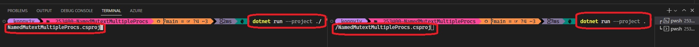

# Interprocess Synchronization with Named Mutex.

- You can also create a named system Mutex, which is the kind that can be shared between processes.

- You do this by using the overloaded constructors that take a name argument. When using a named
Mutex, it is important to see if the Mutex you are looking for has already been created, because it is
possible to create several Mutexes with the same name that exist independently of one another.

- You can test to see if a Mutex exists by using the static Mutex.OpenExisting() method, which takes a string argument as the name of the Mutex you wish to create. If a Mutex with the name you have provided exists, it is returned by the OpenExisting() method. A System.Threading WaitHandleCannotBeOpenedException is thrown if a Mutex has not already been created with that name. Listing 3-13 shows how to use the OpenExisting() method and the overloaded constructor to test for, create, and use a shared Mutex. To test this listing, you must run two or more instances of the compiled program. Control of the Mutex will pass from process to process each time you press the Enter key. If you compile and run the code in this listing, the program will loop forever, so you can safely close the console window when you have had enough.

- To run the example, you need two console windows simultaneously. Using VsCode, do the following.

- Split the console pan as follows.

- Here we go

- Now run the command to start the app

- Press enter to acquire the lock and release on both consoles as follows.

Press Ctrl+C on both the sides to stop the app on both the consoles.

