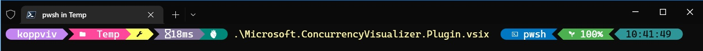
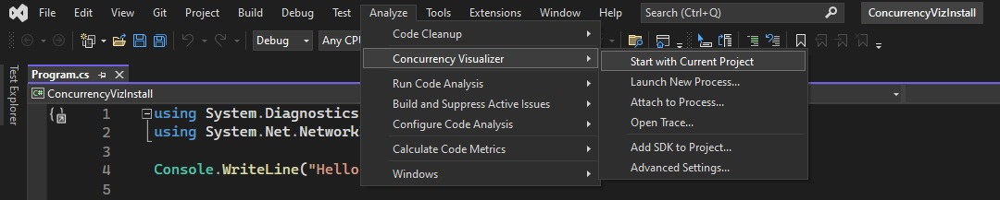

- To use concurrency Visualizer, you first need to intall the extension[https://marketplace.visualstudio.com/items?itemName=Diagnostics.DiagnosticsConcurrencyVisualizer2022]

- You first need to be an admin for installing this, else it will fail. Run powershell as admin, then go to the directory in which you downloaded the vsix file, then run it.

- once installed, run the app. Run the app using visual studio 2022 and then Analyze -> Concurrency Visualizer -> With Current Project

- Note the ids of the process threads and the Threads in the visualizer

