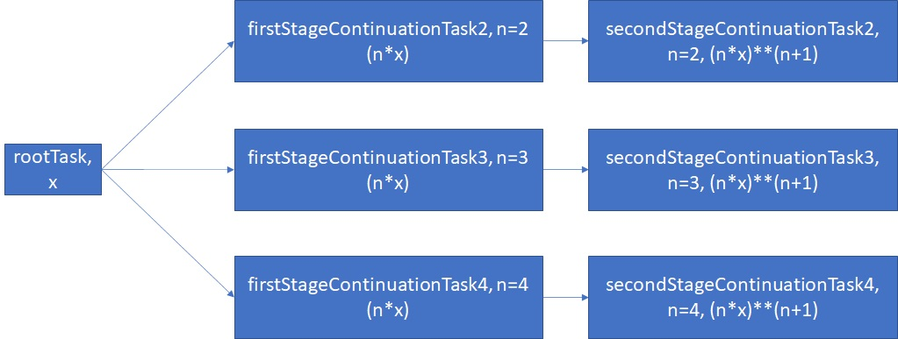

# Many to one, Continuation Tasks

- An antecedent Task can have multiple continuations; that is to say that more than one Task can be automatically scheduled when the antecedent Task has completed. 
- We call ContinueWith() for each continuation we create. And we create chains of continuations by giving each of your continuations its own continuation.
- Just call the ContinueWith() method on the Tasks returned by the previous calls ContinueWith().

- We are calculating, (n*x)**(n+1), for n = 2, 3, 4. The variable x, is taken from the user, and then they are evaluated.
- In the root stage, we will get the value of x from the user.
- In the first stage, we will calculate n*x. 
- Then in the second stage, we will finally calculate (n*x)**(n+1). 
- The ** here is power. So n*x raised to n+1, for n = 2, 3 and 4 

