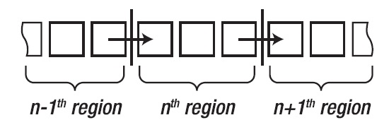

# Performing Parallel Loops with Dependencies

- The parallel loops so far in this chapter have been examples of what is known as embarrassingly parallel problems. 

- This is an unfortunate name, but it means that the work being done is extremely easy to parallelize, because each data element can be processed independently of every other element; that allows the items to be processes in any order and with any degree of concurrency. In other words, these
problems are perfect for demonstrating the new .NET parallel programming features, and they appear at
one end of a spectrum of dependency between items.

- At the other end of the spectrum are problems where there is a very high degree of dependency between data items, for example, generating Fibonacci numbers, where each item is the sum of the previous two items (with 0 and 1 as seed values), a problem that is best solved sequentially.

- In the middle are problems where there is some degree of dependence between some items.

- Generally, such problems are best approached using the techniques to coordinate and synchronize a set of Tasks. There is one situation, however, where we can mix sequential and parallel loops to process data with a particular type of dependency.
 
- The dependency is where the first value in a region of data depends on the last value of the previous region, as illustrated in the following Figure. 

- The nth region of data cannot be completed until the (n – 1) region has been processed, but the items within the region can be processed in parallel.

- A series of bank account transactions must be processed in order to determine the final balance for each month of the year, where each month contains 10,000 transactions. 

- To determine the balance for the end of one month, we need to know the balance of the previous month. Aside from that dependency, we are able to process a month’s transactions concurrently.

- The example solves dependency issue by mixing sequential and parallel loops. The outer loop is sequential and iterates through each monthly region in turn. The inner loop is parallel and sums the individual transactions. 
 
- The result of the parallel loop for one month becomes the seed value for the following month.

- 